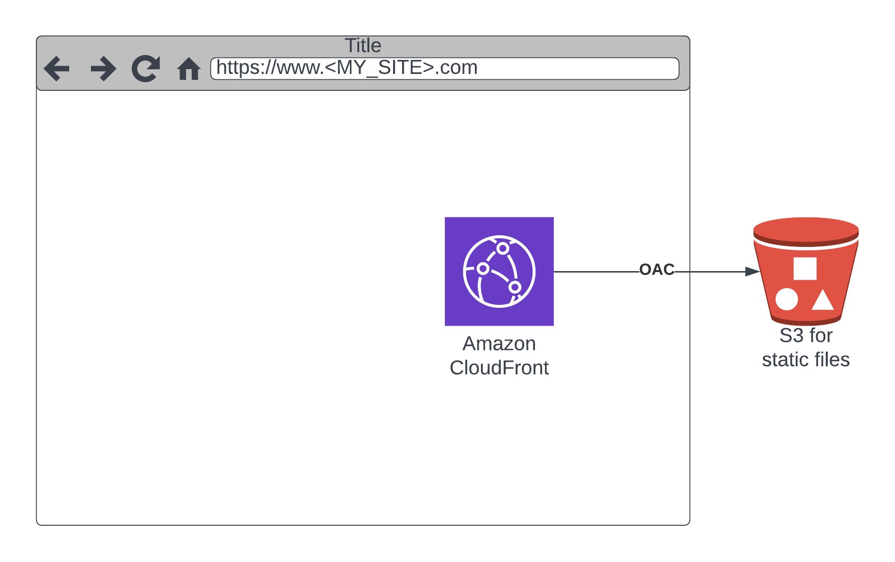

# Personal Website Infrastructure with Terraform and AWS

This repository contains the Terraform configuration files required to deploy my personal website with AWS services. It includes S3 for hosting static content, CloudFront for CDN, and Route 53 for DNS management. Follow the steps in this README to set up and deploy your website.



---

## Table of Contents
1. [Prerequisites](#prerequisites)
2. [Setup Instructions](#setup-instructions)
    - [Download Terraform](#download-terraform)
    - [Download AWS CLI](#download-aws-cli)
    - [Configure AWS Credentials](#configure-aws-credentials)
    - [Set Up Terraform Backend](#set-up-terraform-backend)
    - [Create a `terraform.tfvars` File](#create-a-terraformtfvars-file)
3. [Deploying the Infrastructure](#deploying-the-infrastructure)

---

## Prerequisites

Before you begin, ensure you have the following installed:
- [Terraform](https://developer.hashicorp.com/terraform/downloads) (v1.10.3 or later)
- [AWS CLI](https://aws.amazon.com/cli/) (v2 or later)
- An AWS account with sufficient permissions to create S3 buckets, CloudFront distributions, Route 53 records, and ACM certificates.

---

## Setup Instructions

### 1. Download Terraform
- Visit the [Terraform download page](https://developer.hashicorp.com/terraform/downloads).
- Choose the appropriate version for your operating system and follow the installation instructions.

To verify the installation, run:
```bash
terraform -version
```

### 2. Download AWS CLI
- Visit the [AWS CLI download page](https://aws.amazon.com/cli/).
- Choose the appropriate version for your operating system and follow the installation instructions.

To verify the installation, run:
```bash
aws --version
```

### 3. Configure AWS Credentials
Run the following command to configure your AWS credentials:
```bash
aws configure
```
You will be prompted to enter your:
- AWS Access Key ID
- AWS Secret Access Key
- Default region name (e.g., `us-east-1`)
- Default output format (e.g., `json`)

### 4. Set Up Terraform Backend
The Terraform state file will be stored in an S3 bucket. The configuration for this backend is already defined in the repository:
```hcl
terraform {
  backend "s3" {
    bucket = "bsc.sandbox.terraform.state"
    key    = "personal_website/terraform.tfstate"
    region = "us-east-1"
  }
}
```
Ensure the S3 bucket exists before applying the Terraform configuration.

### 5. Create a `terraform.tfvars` File
Create a `terraform.tfvars` file in the root of the repository with the following required variables:
```hcl
domain      = "yourdomain.com"
environment = "production"
region      = "us-east-1"

tags = {
  Project     = "personal_website"
  Owner       = "<NAME>"
  Provisioner = "Terraform"
}
```
Replace `yourdomain.com` with your actual domain, and customize the `tags` as necessary.

---

## Deploying the Infrastructure

1. Initialize Terraform:
   ```bash
   terraform init
   ```
   This command downloads required providers and configures the backend.

2. Validate the Terraform configuration:
   ```bash
   terraform validate
   ```
   This ensures your configuration files are syntactically correct.

3. Plan the infrastructure changes:
   ```bash
   terraform plan -out=plan.out
   ```
   This generates an execution plan for review.

4. Apply the configuration:
   ```bash
   terraform apply plan.out
   ```
   Confirm the prompt to proceed with the deployment.

5. Verify the deployment:
   - The CloudFront distribution and S3 bucket should now be live.
   - Navigate to your domain to check the website.

---
